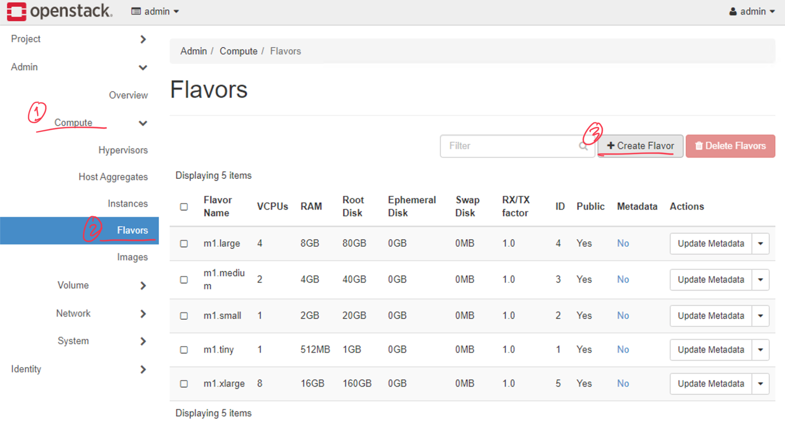
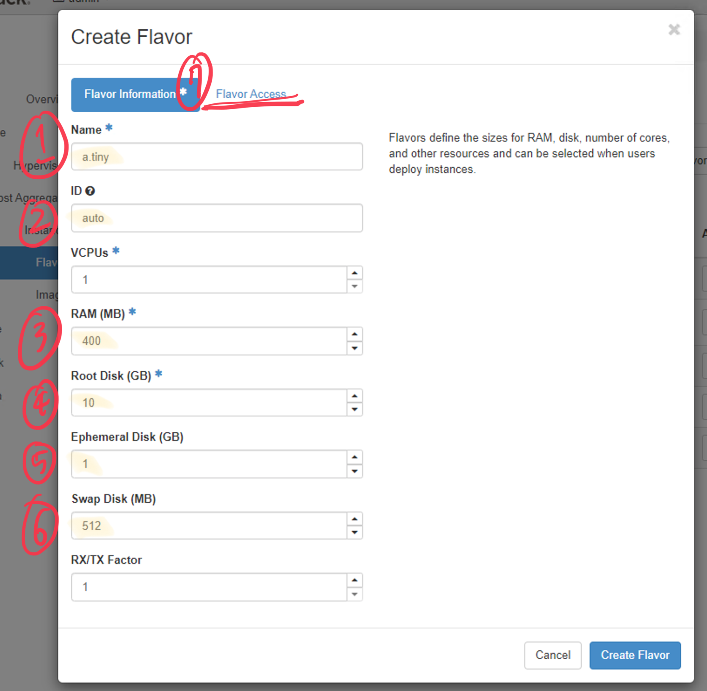
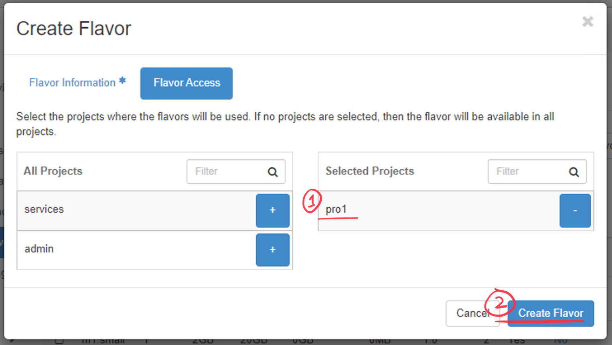
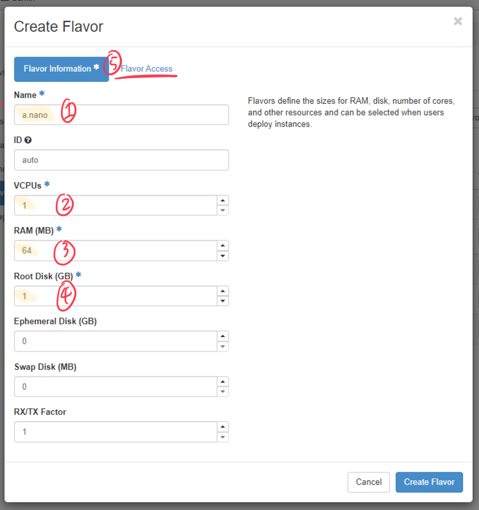

#  `Flavor`
## `Flavor` 란?
- `Flavor`를 통해 생성할 `Nova` 의 성능을 정해둘 수 있다.
- 일반 `__member__` 계정은 생성할 수 없고 `Admin` 권한을 가진 계정부터 생성 가능하다.

## `Flavor` 생성
`Admin` -> `Compute` -> `Flavors` 에서 생성할 수 있다.

`Flovor Information` 에서 생성할 `Flovor`의 이름, 성능 등을 설정할 수 있다.

`Flavor Access` 탭 에서 생성할 `Flavor` 를 이용해서 `Instance` 를 생성할 수 있는 `Project` 를 지정할 수 있다.

---
> `a.nano` Falvor 생성 예시

| | |
|---|---|
|  |  |