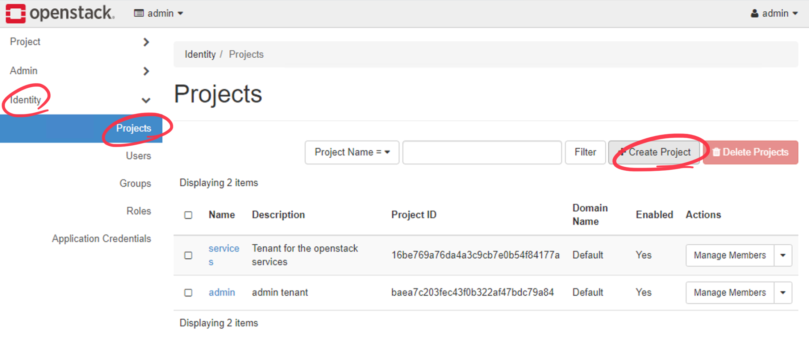
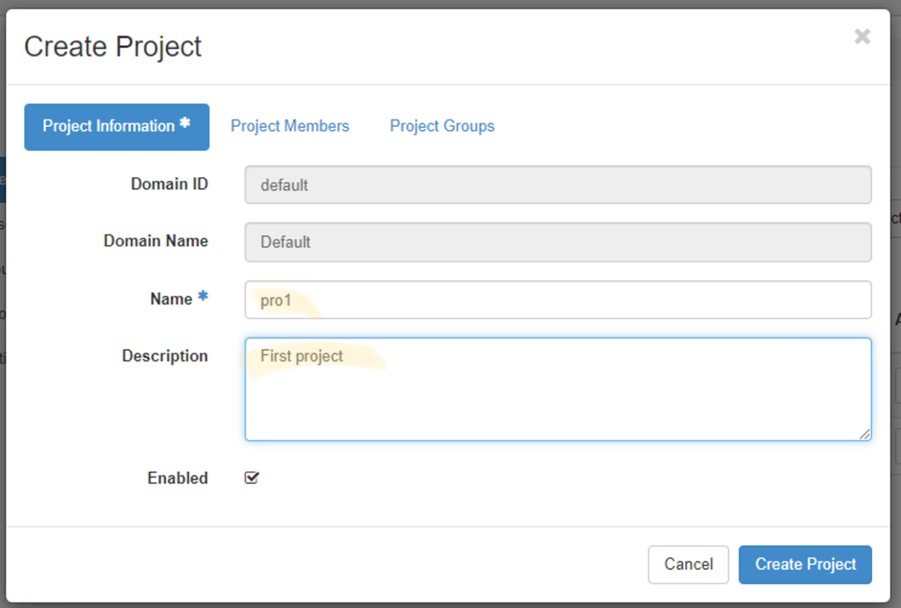
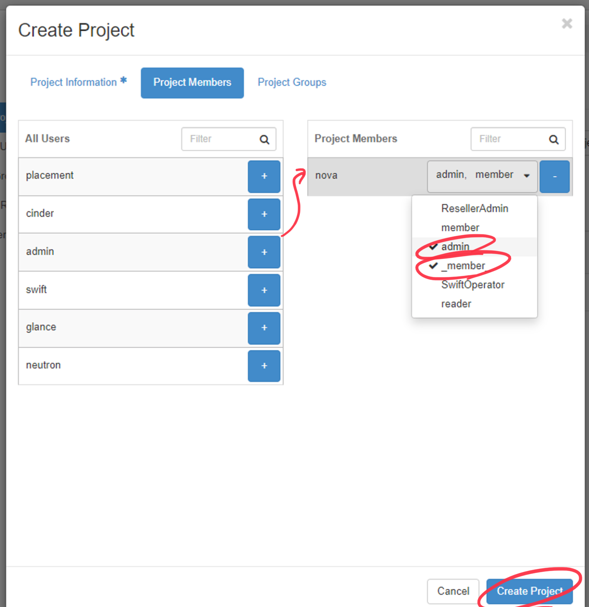
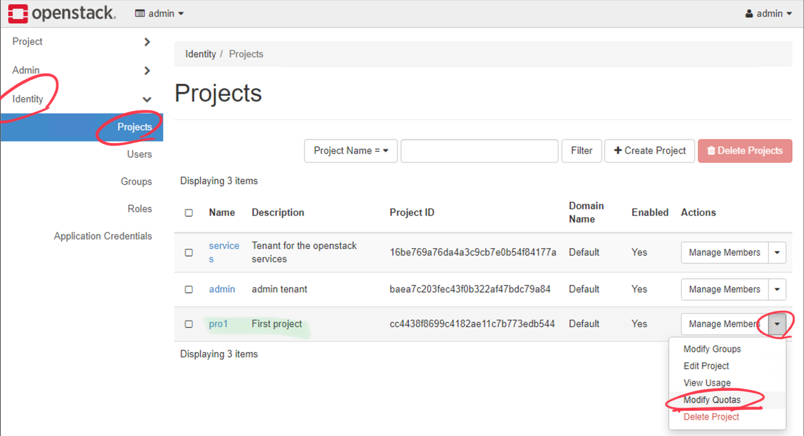
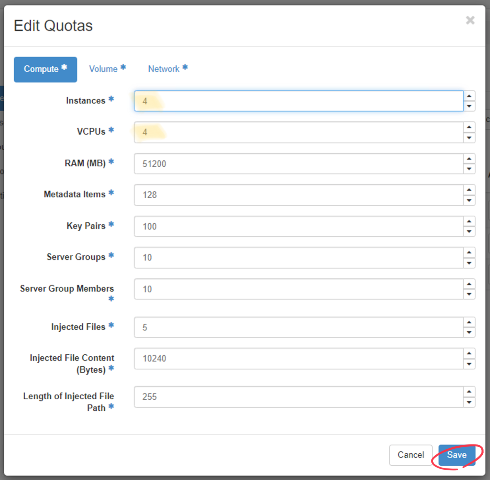

#  `project`
> 원래 이름은 [`tenant`] 였지만 `project` 로 이름이 바뀌었다.

## Project 란?
- `Openstack` 의 기본 소유 단위
- 모든 리소스는 특정 프로젝트에서 소유해야 함
- `OpenStack Identity` 에서 프로젝트는 특정 `Domain` 이 소유해야 함

## 프로젝트 생성하기
`Identity` -> `Project` 에서 `+ Create Project` 에서 수정할 수 있다.

`project` 정보
`Create Project` 창의 `Project Information` 에서 `Name` 과 `Description` 을 입력한다.

`Project Members` 추가 **????**
> `nova` 선택 후, `admin`과 `member` `role`을 추가한다.

## `Quoats` 수정
`Identity` -> `Project` 에서 생성한 프로젝트의 설정 메뉴 중 `Modify Quoats` 에서 수정할 수 있다

`Compute` 탭에서 최대 허용 값을 수정할 수 있다.

[`tenant`]: https://wiki.openstack.org/wiki/Tenant