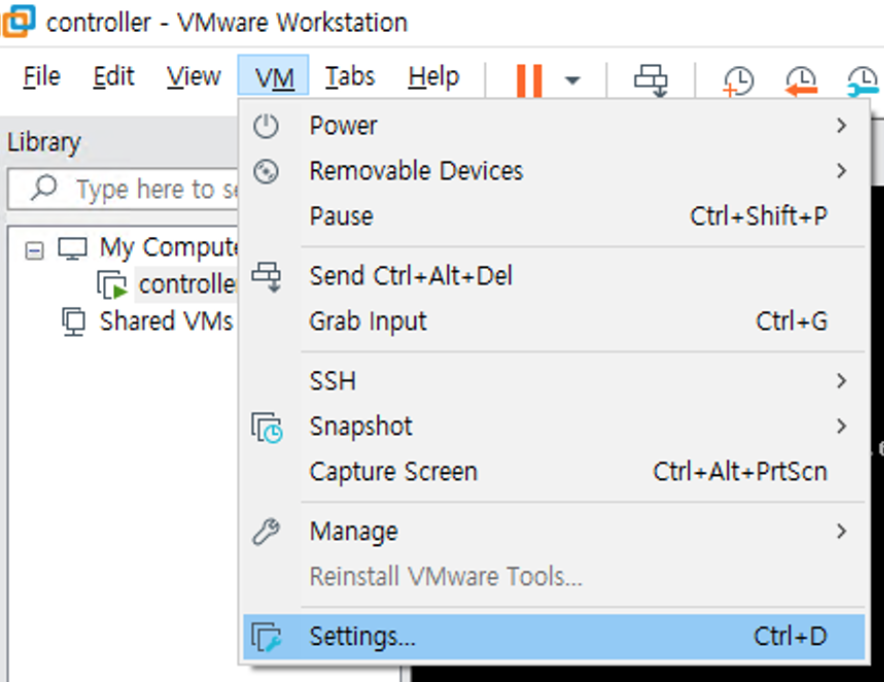
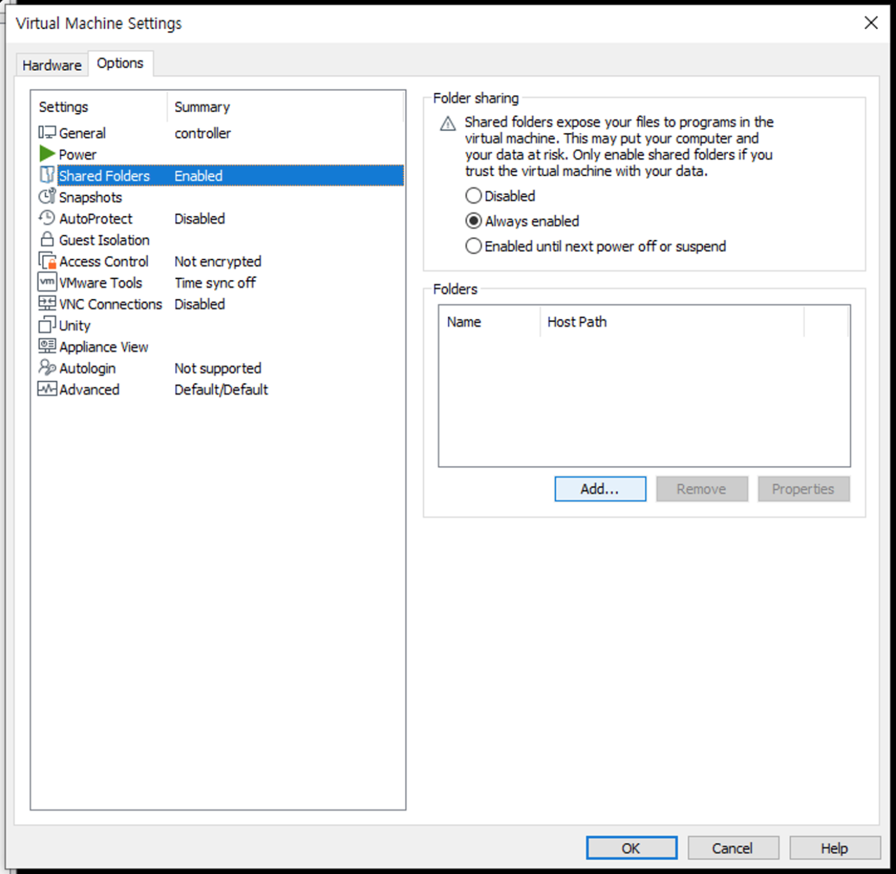
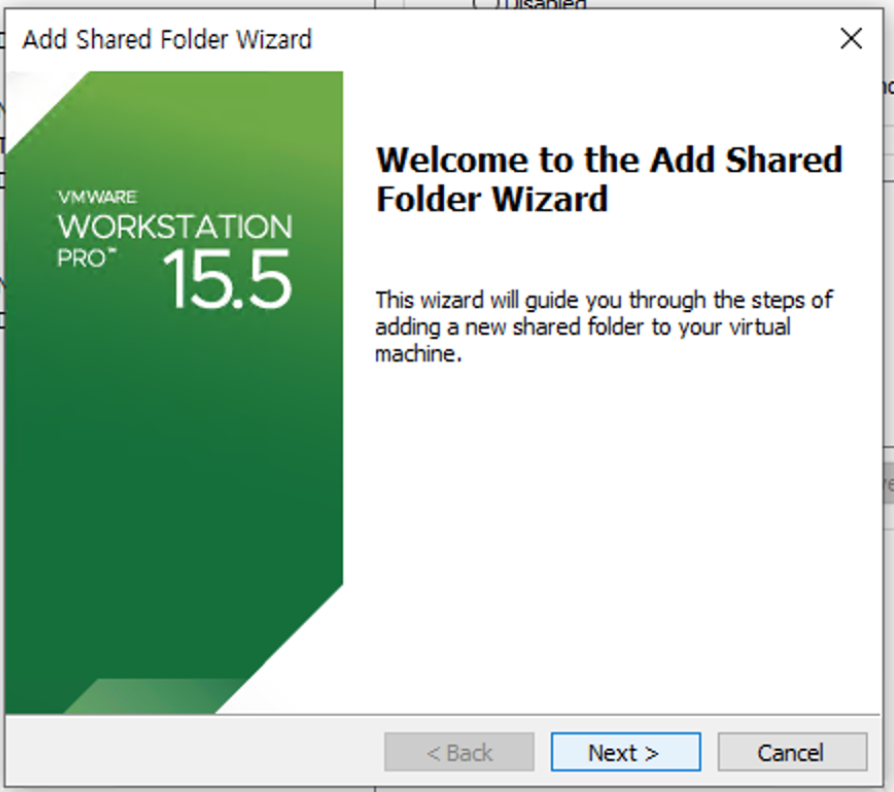
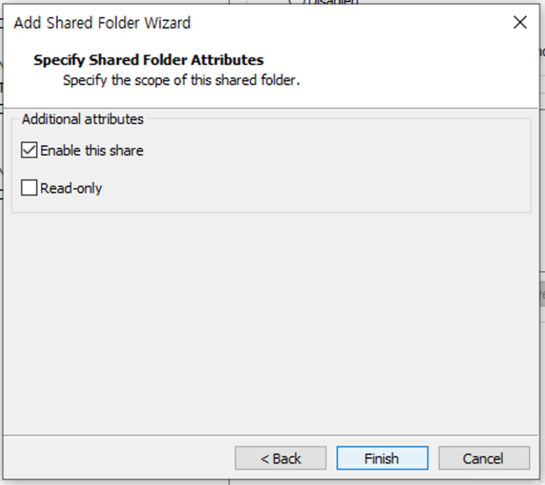
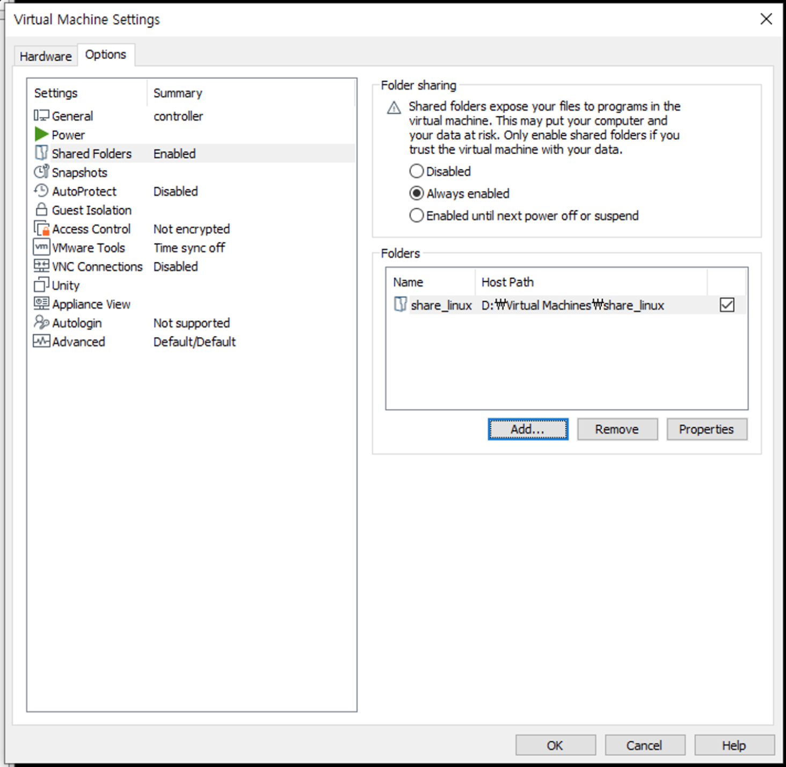

# VMware 에서 폴더 공유하기









```shell
[root@controller ~]# mkdir /share
```
```shell
[root@controller ~]# vmhgfs-fuse /share
```
```shell
[root@controller ~]# df -h
Filesystem               Size  Used Avail Use% Mounted on
devtmpfs                 2.9G     0  2.9G   0% /dev
tmpfs                    2.9G  4.0K  2.9G   1% /dev/shm
tmpfs                    2.9G  101M  2.8G   4% /run
tmpfs                    2.9G     0  2.9G   0% /sys/fs/cgroup
/dev/mapper/centos-root   60G  3.1G   57G   6% /
/dev/loop0               1.9G   19M  1.7G   2% /srv/node/swiftloopback
/dev/sda1               1014M  194M  821M  20% /boot
/dev/mapper/centos-home  2.0G   33M  2.0G   2% /home
tmpfs                    577M     0  577M   0% /run/user/0
vmhgfs-fuse              2.3T  650G  1.7T  29% /share
```
```shell
[root@controller ~]# ls /share
share_linux
```
```shell
[root@controller ~]# ls /share/share_linux/
stack1-key1.pem  user1-key1.pem
```