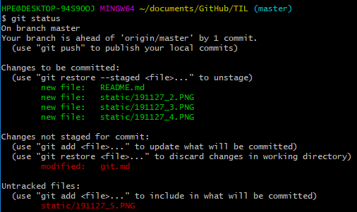
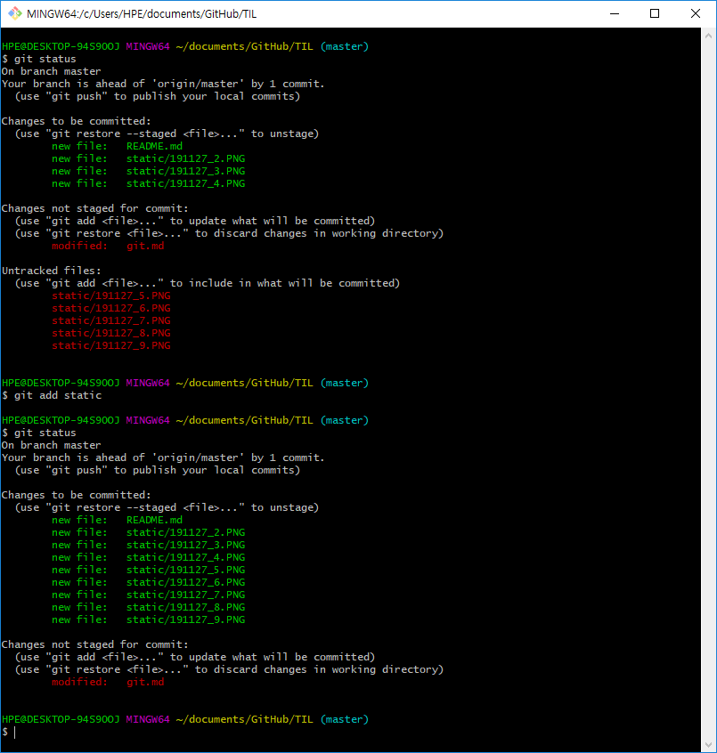
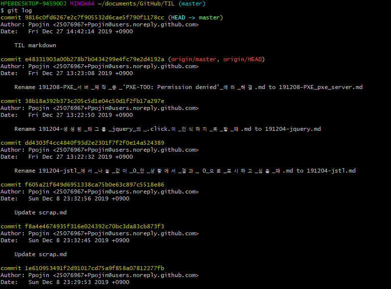
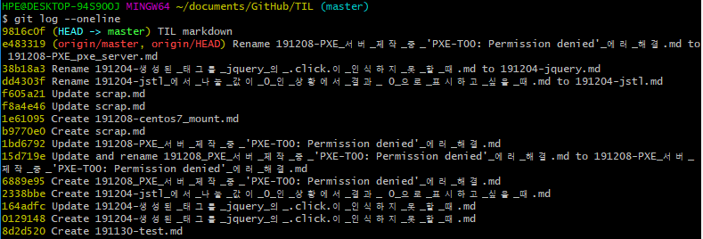
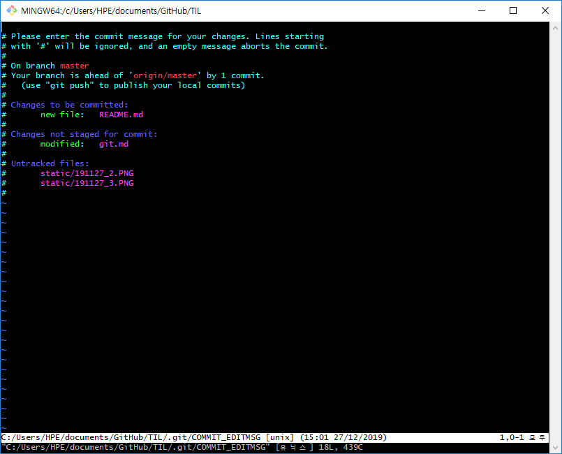
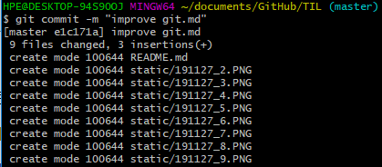
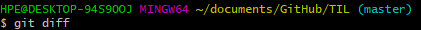
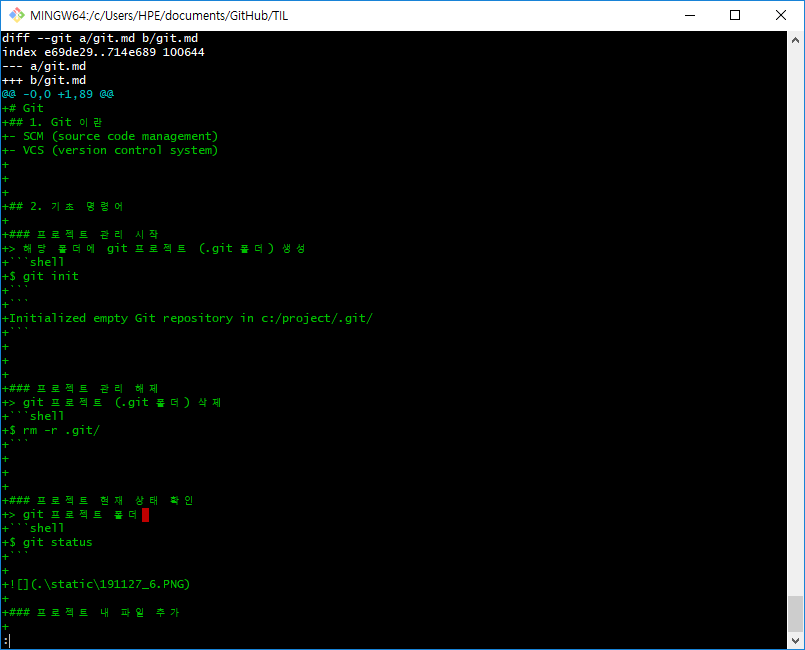
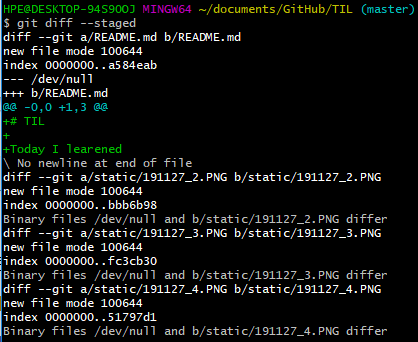

# Git
## 1. Git 이란
- SCM (source code management)
- VCS (version control system)


## 2. 기초 명령어

### 프로젝트 관리 
```shell
$ git init
```

> 해당 폴더에 git 프로젝트 (.git 폴더) 생성

```shell
Initialized empty Git repository in c:/project/.git/
```


### 프로젝트 관리 해제
```shell
$ rm -r .git/
```
> git 프로젝트 (.git 폴더) 삭제


### 프로젝트 현재 상태 확인
```shell
$ git status
```
> git 프로젝트 폴더 
> 

### 프로젝트 내 파일 추가
```shell
$ git add <fileName>
```
> `git commit` 전에 파일 추가

```shell
$ git add <dirName>
```

> 디렉토리 내 모든 파일 추가
> 


### git log


```shell
$ git log
```
> `git commit` 후 commit 내역 확인
> 

```shell
$ git log --oneline
```
> 한줄로 간단하게 저장 : `--oneline`
> 

### git commit

```shell
$ git commit
```
> 프로젝트 업로드
> 


```shell
$ git commit -m "Add README.md"
```

> `-m` 속성으로 vi 에디터를 넘겨서 commit message 를 입력할 수 있다.
> 

### git diff

수정된 코드 확인

```shell
$ git diff
```

> 입력 시 새로운 쉘 전체를 이용해서 변경된 사항을 보여준다
> 
> 

```shell
$ git diff --staged
```
> 이건뭘까
> 


### git checkout

