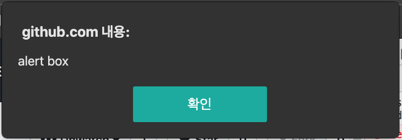
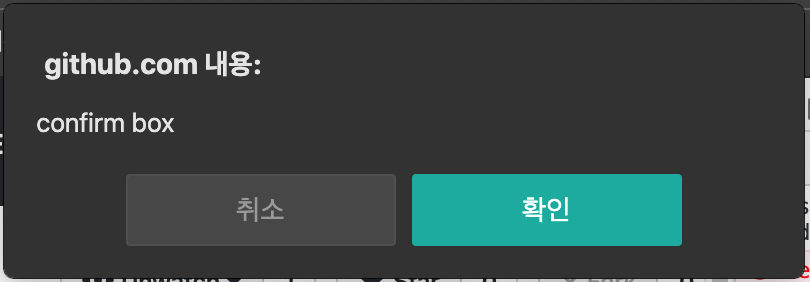
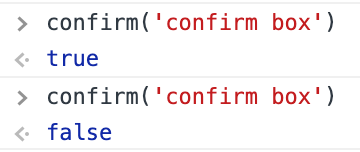
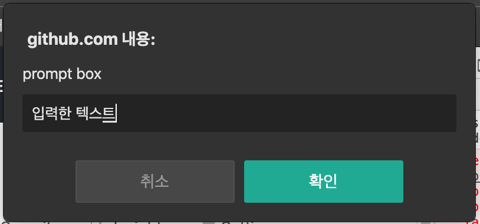
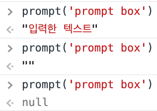

# javascript 메세지박스
## alert
```js 
alert('alert box');
```


- 아무 값도 리턴하지 않음.

    


## confirm
```js
confirm('confirm box');
```


- 확인을 누르면 `true` 를 리턴함
- 취소를 누르면 `false` 를 리턴함.

    


## prompt
```js
prompt('prompt box');
```


- 값을 입력하고 확인을 누르면 입력한 문자열 값을 리턴함.
- 값을 입력하지 않고 확인을 누르면 빈 문자열(`""`)을 리턴함.
- 취소를 누르면 `null` 을 리턴함.
    
